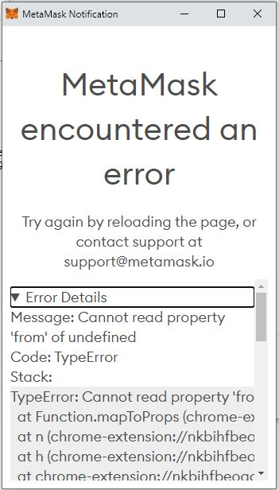

# Demo for an error in Metamask

Requesting `eth_decrypt` multiple times results in a Metamask error:


```
Message: Cannot read property 'from' of undefined

Code: TypeError

Stack:
TypeError: Cannot read property 'from' of undefined
  at Function.mapToProps (chrome-extension://nkbihfbeogaeaoehlefnkodbefgpgknn/ui.js:152:634958)
  at n (chrome-extension://nkbihfbeogaeaoehlefnkodbefgpgknn/ui-libs.js:99:20773)
  at h (chrome-extension://nkbihfbeogaeaoehlefnkodbefgpgknn/ui-libs.js:99:19379)
  at chrome-extension://nkbihfbeogaeaoehlefnkodbefgpgknn/ui-libs.js:99:19586
  at chrome-extension://nkbihfbeogaeaoehlefnkodbefgpgknn/ui-libs.js:99:12990
  at Object.useMemo (chrome-extension://nkbihfbeogaeaoehlefnkodbefgpgknn/ui-libs.js:81:64645)
  at useMemo (chrome-extension://nkbihfbeogaeaoehlefnkodbefgpgknn/ui-libs.js:148:5250)
  at _ (chrome-extension://nkbihfbeogaeaoehlefnkodbefgpgknn/ui-libs.js:99:12934)
  at ca (chrome-extension://nkbihfbeogaeaoehlefnkodbefgpgknn/ui-libs.js:81:59367)
  at Ga (chrome-extension://nkbihfbeogaeaoehlefnkodbefgpgknn/ui-libs.js:81:67589)
  at Va (chrome-extension://nkbihfbeogaeaoehlefnkodbefgpgknn/ui-libs.js:81:67408)
  at El (chrome-extension://nkbihfbeogaeaoehlefnkodbefgpgknn/ui-libs.js:81:107905)
  at bu (chrome-extension://nkbihfbeogaeaoehlefnkodbefgpgknn/ui-libs.js:81:90053)
  at pu (chrome-extension://nkbihfbeogaeaoehlefnkodbefgpgknn/ui-libs.js:81:89978)
  at iu (chrome-extension://nkbihfbeogaeaoehlefnkodbefgpgknn/ui-libs.js:81:87326)
  at chrome-extension://nkbihfbeogaeaoehlefnkodbefgpgknn/ui-libs.js:81:45768
  at r.unstable_runWithPriority (chrome-extension://nkbihfbeogaeaoehlefnkodbefgpgknn/ui-libs.js:184:3472)
  at Vo (chrome-extension://nkbihfbeogaeaoehlefnkodbefgpgknn/ui-libs.js:81:45477)
  at Yo (chrome-extension://nkbihfbeogaeaoehlefnkodbefgpgknn/ui-libs.js:81:45713)
  at Ko (chrome-extension://nkbihfbeogaeaoehlefnkodbefgpgknn/ui-libs.js:81:45648)
  at au (chrome-extension://nkbihfbeogaeaoehlefnkodbefgpgknn/ui-libs.js:81:87618)
  at Object.notify (chrome-extension://nkbihfbeogaeaoehlefnkodbefgpgknn/ui-libs.js:99:24588)
  at e.t.notifyNestedSubs (chrome-extension://nkbihfbeogaeaoehlefnkodbefgpgknn/ui-libs.js:99:24155)
  at e.t.handleChangeWrapper (chrome-extension://nkbihfbeogaeaoehlefnkodbefgpgknn/ui-libs.js:99:24223)
  at b (chrome-extension://nkbihfbeogaeaoehlefnkodbefgpgknn/ui.js:137:63292)
  at Object.dispatch (chrome-extension://nkbihfbeogaeaoehlefnkodbefgpgknn/ui.js:137:57268)
  at dispatch (chrome-extension://nkbihfbeogaeaoehlefnkodbefgpgknn/ui.js:137:77709)
  at clearConfirmTransaction (chrome-extension://nkbihfbeogaeaoehlefnkodbefgpgknn/ui.js:152:635276)
  at onClick (chrome-extension://nkbihfbeogaeaoehlefnkodbefgpgknn/ui.js:152:632984)
  ```

## Steps to reproduce using the demo

### Happy Path

1. click `connect` to connect MetaMask to the App
2. Under the Encrypt heading insert data into the input field and click the Encrypt Button. Provide the app the public encryption key. 
3. Under the Decrypt heading, click `Decrypt All`. In Metamask, decrypt item

### Broken Part
4. Add a second item in Encryptio following step 2.
5. Click 'Decrypt All'. Decrypt first message, then error shows, if you close the error, then it requests to decrypt the second message.

## What should happen

The error message should not appear.
